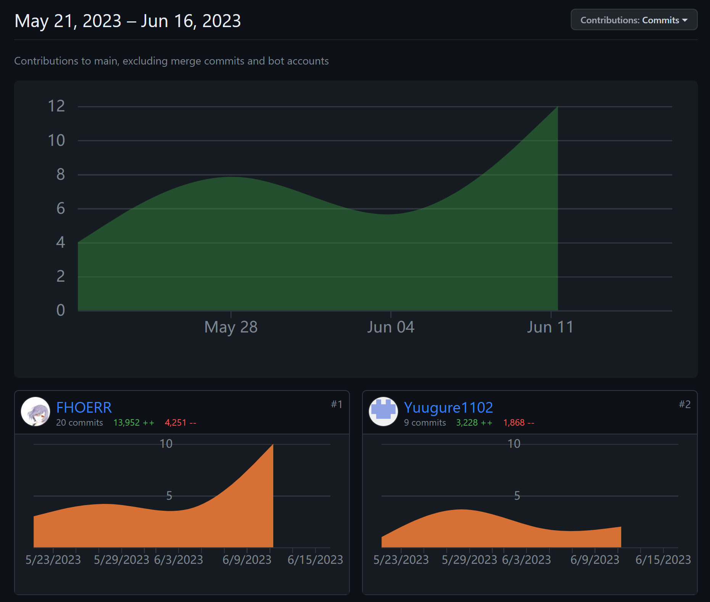
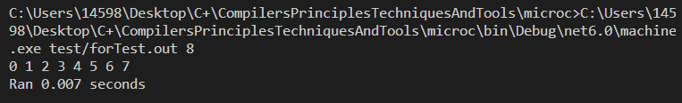
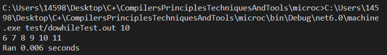
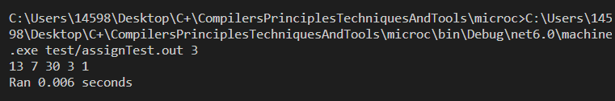
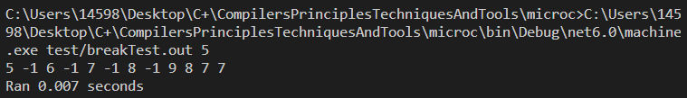
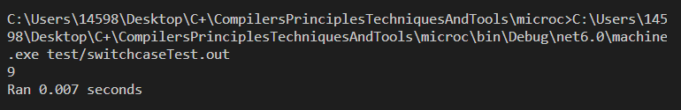
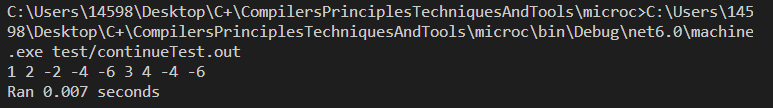
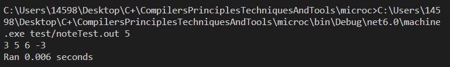
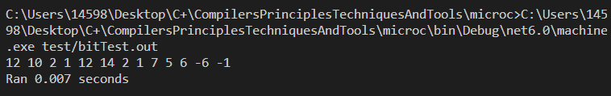

# 2020-2021学年第2学期
# 实 验 报 告


* 课程名称:编程语言原理与编译
* 实验项目:期末大作业
* 专业班级:<u> 计算机2004 </u>
* 学生学号:<u>&nbsp;&nbsp; 32001056 &nbsp;&nbsp; 32001108 &nbsp;&nbsp;</u>
* 学生姓名:<u>&nbsp;&nbsp;&nbsp;&nbsp;&nbsp;吴宝俊 &nbsp;&nbsp;&nbsp;&nbsp;&nbsp;&nbsp;&nbsp; 杨文韬 &nbsp;&nbsp;&nbsp;&nbsp;&nbsp;</u>
* 实验指导教师:郭鸣

# 实验内容
### 成员信息

| 姓名 | 学号 | 班级 | 任务      | 权重 |
| --- | --- | --- |---------| --- |
|吴宝俊|32001056|计算机2004| 编码+实验报告 |0.95|
|杨文韬|32001108|计算机2004| 编码+实验报告 |0.95|

### 成员代码提交日志


### 项目自评等级:(1-5)

| 词法                     | 词法 | 备注 |
| ----------------------- | --- | --- |
| 语法                     |  |  |
| if的多种方式——switch case | ⭐⭐    |      |
| 循环 for                 | ⭐⭐⭐   |      |
| 循环 do while            |⭐⭐⭐||
| 循环 until               |⭐⭐⭐⭐||
| 语义                     |||
| i++,i--,++i,--i         |⭐⭐⭐||
| +=,-=,*=,/=,%=          |⭐⭐⭐||
| 三元运算符 ? :            |⭐⭐⭐||
| break                   |⭐⭐⭐⭐⭐||
| continue                |⭐⭐⭐⭐||
| 位运算                   |⭐⭐⭐⭐⭐||

### 项目说明
1. **for模块实现**

修改了Absyn.fs文件39行

```
  | For of expr * expr * expr * stmt (* For                         *)
```
修改了CLex.fsl文件32行
```
| "for"     -> FOR
```
修改了Comp.fs文件190行
```
| For (e1, e2, e3, body) ->
        let labbegin = newLabel()
        let labtest  = newLabel()
        let labnext = newLabel()
        let labend = newLabel()
        pushbeglist labnext
        pushendlist labend
        cExpr e1 varEnv funEnv @ [INCSP -1]
            @ [GOTO labtest; Label labbegin]
                @ cStmt body varEnv funEnv
                    @ [ Label labnext ]
                        @ cExpr e3 varEnv funEnv @ [INCSP -1]
                            @ [Label labtest]
                                @ cExpr e2 varEnv funEnv @ [IFNZRO labbegin]
                                    @ [ Label labend ] @ popbeglist () @ popendlist ()
```
修改了CPar.fsy文件20行
```
%token CHAR ELSE IF INT NULL PRINT PRINTLN RETURN VOID WHILE FOR
```
修改了Interp.fs文件292行

```
    | For (e1, e2, e3, body) ->
    let (v, store1) = eval e1 locEnv gloEnv store
    let rec loop store1 = 
        let (v,store2) = eval e2 locEnv gloEnv store1
        if v<>0 then loop(snd(eval e3 locEnv gloEnv (exec body locEnv gloEnv store2)))
        else store2

    loop store1
```

测试代码存放于test/forTest.c
``` c
void main (int n){
    int a;
    for (a = 0;a < n;a = a + 1){
        print a;
    }
}
```
测试成果<br>


2.**i++,i--,++i,--i模块实现**

修改了Absyn.fs文件26行
```
| Prim3 of string * access         (* i++ i-- ++i i--             *)
```

修改了CLex.fsl文件75、76行

```
  | "++"            { PREINC }
  | "--"            { PREDEC }
```

修改了CPar.fsy文件21行

```
%token PLUS MINUS TIMES DIV MOD PREINC PREDEC
```

修改了Comp.fs文件266行
```
    | Prim3 (ope, e) ->
        (match ope with
            | "I++" ->
                cAccess e varEnv funEnv
                 @[ DUP;LDI;SWAP;DUP;LDI;CSTI 1; ADD;STI;INCSP -1]
            | "I--" ->
                cAccess e varEnv funEnv
                 @[ DUP;LDI;SWAP;DUP;LDI;CSTI -1; ADD;STI;INCSP -1]
            | "++I" ->
                cAccess e varEnv funEnv
                 @[ DUP;LDI; CSTI 1; ADD;STI]
            | "--I" ->
                cAccess e varEnv funEnv
                 @[ DUP;LDI; CSTI -1; ADD;STI]
            | _ -> raise (Failure "unknown primitive 4")
            )
```

修改了Interp.fs文件
```
    | Prim3(ope, acc) ->
        let (loc, store1) = access acc locEnv gloEnv store
        let (i1) = getSto store1 loc
        match ope with
            | "I++" ->
                let res = i1 + 1
                i1, setSto store1 loc res
            | "I--" ->
                let res = i1 - 1
                i1, setSto store1 loc res
            | "++I" ->
                let res = i1 + 1
                res, setSto store1 loc res
            | "--I" ->
                let res = i1 - 1
                res, setSto store1 loc res
            | _ -> failwith ("unknown primitive " + ope)
```

测试代码存放于test/++Test2.c
``` c
void main(int n)
{
  print n;
  n++;
  ++n;
  print n;
  n=5;
  n--;
  --n;
  print n;
}
```

测试成果<br>


3.**dowhile模块实现**

Absyn.fs

```
  | DoWhile of stmt * expr           (* Do While                    *)
```

CLex.fsl

```
    | "do"      -> DO
```

CPar.fsy

```
  	| DO StmtM WHILE LPAR Expr RPAR SEMI  { DoWhile($2, $5)      }
  
%token CHAR ELSE IF INT NULL PRINT PRINTLN RETURN VOID WHILE FOR DO
```

Comp.fs

```
    | DoWhile (body, e) ->
        let labbegin = newLabel ()
        let labtest = newLabel ()
        let labend = newLabel ()
        pushbeglist labbegin
        pushendlist labend
        cStmt body varEnv funEnv
            @[ GOTO labtest ]
                @[ Label labbegin ]
                @ cStmt body varEnv funEnv
                @ [ Label labtest ]
                @ cExpr e varEnv funEnv
                @ [ IFNZRO labbegin ]
                @ [ Label labend ] @ popbeglist () @ popendlist ()
```

Interp.fs

```
    | DoWhile (body, e) ->
        let rec loop store1 =
            let (v, store2) = eval e locEnv gloEnv store1
            if v <> 0 then
                loop (exec body locEnv gloEnv store2)
            else
                store2
        
        loop (exec body locEnv gloEnv store)
```

测试代码存放于test/dowhileTest.c

``` c
void main (int n){
  int a;
  a=5;
  do
  {
    a=a+1;
    print a;
  } while (a<=n);
  
}
```

测试成果<br>



4.**三元运算符模块实现**

Absyn.fs

```
  | Prim4 of expr * expr * expr      (*  ? :                        *)
```
Backend.fs
```
    | TERNARY ->
        ";TERNARY\n\t\
                    pop rcx\n\t\
                    pop rbx\n\t\
                    pop rax\n\t\
                    cmp rax, 0\n\t\
                    je lab_false\n\t\
                    mov rax, rbx\n\t\
                    jmp lab_end\n\t\
                    lab_false:\n\t\
                    mov rax, rcx\n\t\
                    lab_end:\n\t\
                    push rax\n\t"
```

CLex.fsl

```
  | '?'             { QST  } 
  | ':'             { COLON  }
```

CPar.fsy

```
%token QST COLON // ? :

  | Expr QST Expr COLON Expr            { Prim4($1, $3, $5)        } // ?:
```

Interp.fs

```
    | Prim4 (e1, e2, e3) ->
        let (i1, store1) = eval e1 locEnv gloEnv store
        let (i2, store2) = eval e2 locEnv gloEnv store1
        let (i3, store3) = eval e3 locEnv gloEnv store2
        let res = if i1<>0 then i2 else i3
        (res, store3)
```
machine.c
```
#define TERNARY 32

  case TERNARY:
    printf("TERNARY");
    break;
    
    
    case TERNARY:
    {
        s[sp - 2] = (s[sp - 2] == 0 ? s[sp] : s[sp - 1]);
        sp--; sp--;
    }
```
Machine.cs
```
      BITLEFT = 26, BITRIGHT = 27, BITNOT = 28, BITAND = 29, BITOR = 30, BITXOR = 31, TERNARY = 32;
      
                case TERNARY:
                    {
                        s[sp - 2] = (s[sp - 2] == 0 ? s[sp] : s[sp - 1]);
                        sp--; sp--;
                    }
                    break;
                    
            case TERNARY: return "TERNARY";
```
测试代码存放于test/sanyuanTest.c

``` c
void main()
{
  int x;
  int y;
  int n;
  x=-1;
  y=0;
  n = (x > y) ? x : y;
  print n;
}
```
测试成果<br>


5.**+=、-=、*=、/=、%=模块实现**

Absyn.fs

```
  | AssignPrim of string * access * expr (* += -= *= /= %=             *)
```

CLex.fsl

```
  | "+="            { PLUSAS }
  | "-="            { MINUSAS }
  | "*="            { TIMESAS }
  | "/="            { DIVAS }
  | "%="            { MODAS }
```

CPar.fsy

```
  %token PLUS MINUS TIMES DIV MOD PREINC PREDEC PLUSAS MINUSAS TIMESAS DIVAS MODAS
  | Access PLUSAS Expr                  { AssignPrim("+=", $1, $3) } 
  | Access MINUSAS Expr                 { AssignPrim("-=", $1, $3) } 
  | Access TIMESAS Expr                 { AssignPrim("*=", $1, $3) }
  | Access DIVAS Expr                   { AssignPrim("/=", $1, $3) }
  | Access MODAS Expr                   { AssignPrim("%=", $1, $3) }
```

Comp.fs

```
    | AssignPrim (ope, e1, e2) ->
        cAccess e1 varEnv funEnv
         @ [DUP; LDI]
            @ cExpr e2 varEnv funEnv
                @ (match ope with
                    | "+=" -> [ ADD; STI ]
                    | "-=" -> [ SUB; STI ]
                    | "*=" -> [ MUL; STI ]
                    | "/=" -> [ DIV; STI ]
                    | "%=" -> [ MOD; STI ]
                    | _ -> raise (Failure "unknown AssignPrim"))

```

Interp.fs

```
    | AssignPrim(ope, acc, e) ->
        let (loc, store1) = access acc locEnv gloEnv store
        let tmp = getSto store1 loc
        let (res, store2) = eval e locEnv gloEnv store1
        let num = 
            match ope with
            | "+=" ->  tmp + res
            | "-=" ->  tmp - res
            | "*=" ->  tmp * res
            | "/=" ->  tmp / res
            | "%=" ->  tmp % res
            | _ -> failwith ("unknown primitive " + ope)
        (num, setSto store2 loc num)
```

测试代码存放于test/assignTest.c

``` c
void main(int n)
{
  int a;
  a = 10;
  a += n;
  print a;
  a = 10;
  a -= n;
  print a;
  a = 10;
  a *= n;
  print a;
  a = 10;
  a /= n;
  print a;
  a = 10;
  a %= n;
  print a;
}
```

测试成果<br>



6.**break实现**

Absyn.fs
```
| Break                            (* Break                       *)
```

CLex.fsl
```
| "break"   -> BREAK
```

CPar.fsy
```
  | BREAK SEMI                          { Break                }
```

Comp.fs
<br>在每个涉及到break的模块的comp.fs均有改变, 已经直接反映到对应的实验报告代码中
<br>此处仅存放break主体以及为了写break添加的用list模拟的栈

```
// 存储labend的栈
let mutable endlist : label list = []
// 存储labbegin的栈
let mutable beglist : label list = []

// endlist顶端元素入栈
let rec pushendlist labs =
    endlist <- labs :: endlist
    []

// beglist顶端元素入栈
let rec pushbeglist labs =
    beglist <- labs :: beglist
    []

// endlist顶端元素出栈
let rec popendlist () =
    endlist <-
        match endlist with
            | lab :: tr -> tr
            | []        -> failwith "Error: empty loop"
    []

// beglist顶端元素出栈
let rec popbeglist () =
    beglist <-
        match beglist with
            | lab :: tr -> tr
            | []        -> failwith "Error: empty loop"
    []

// 获取labs栈顶元素(要记得pop)
let rec toplab labs =
    match labs with
        | lab :: tr -> lab
        | []        -> failwith "Error: unknown break/continue"
        


    | Break ->
        let labend = toplab endlist
        [GOTO labend]
```

Interp.fs
```
    | Break -> store
```

测试代码存放于test/breakTest.c

``` c
void main (int n){
    int a;
    a = n;
    int b;
    b = 0;
    while (a < 11) {
        print a;
        while (b < 3){
            print -1;
            break;
            b = b + 1;
        }
        a = a + 1;
        if(a == 9){
            break;
        }
    }

    for (a;a > 5;a = a - 1){
        print a;
        if (a == 7){
            print a;
            break;
        }
    }
}
```

测试成果<br>


7.**switchcase实现**

Absyn.fs

```
  | Switch of expr * stmt list       (* Switch                      *)
  | Case of expr * stmt              (* Case                        *)
  | Default of stmt                  (* Default                     *)
```

CLex.fsl

```
    | "switch"  -> SWITCH
    | "case"    -> CASE
    | "default" -> DEFAULT
```

CPar.fsy

```
  | SWITCH LPAR Expr RPAR LBRACE CaseList RBRACE { Switch($3, $6)       }
  %token CHAR ELSE IF INT NULL PRINT PRINTLN RETURN VOID WHILE FOR DO BREAK SWITCH CASE DEFAULT
  CaseList:
                        { [] }
  | CaseDec             { [$1] }
  | CaseDec CaseList    { $1 :: $2 }
  | DEFAULT COLON Stmt  { [Default($3)] }
;

CaseDec:
  CASE Expr COLON Stmt  { Case($2, $4)  }
;
```

Comp.fs

```
    | Switch(e, cases) ->
        let rec searchcases c =
            match c with
            | Case (e, body) :: tail ->
                let labend = newLabel ()
                let labfin = newLabel ()

                [DUP]
                    @ cExpr e varEnv funEnv
                        @ [EQ]
                            @ [ IFZERO labend ]
                                @ cStmt body varEnv funEnv
                                    @ [ GOTO labfin ]
                                        @ [ Label labend ]
                                            @ searchcases tail
                                                @ [ Label labfin ]
            | Default body :: [] ->
                cStmt body varEnv funEnv
            | [] -> []

        cExpr e varEnv funEnv
            @ searchcases cases
                @ [ INCSP -1 ]

    | Case (e, body) -> cStmt body varEnv funEnv
    | Default (body) -> cStmt body varEnv funEnv
  
```

Interp.fs

```
    | Switch(e, body) ->
        let (v, store0) = eval e locEnv gloEnv store
        let rec carry list = 
            match list with
            | Case(e1, body1) :: next ->
                let (v1, store1) = eval e1 locEnv gloEnv store0
                if v1 = v then exec body1 locEnv gloEnv store1
                else carry next
            | Default(body) :: over ->
                exec body locEnv gloEnv store0
            | [] -> store0
            | _ -> store0

        (carry body)

    | Case (e, body) -> exec body locEnv gloEnv store
    | Default(body) -> exec body locEnv gloEnv store
```

测试代码存放于test/switchcaseTest.c

``` c
void main()
{
  int a;
  a = 3;
  switch (a)
  {
  case 1:
    print a;
  case 2:
    print a+1;
  default:
    print (a*a);
  }
}
```

测试成果<br>



8.**continue实现**

Absyn.fs
```
  | Continue                         (* Continue                    *)
```

CLex.fsl
```
  | "continue"-> CONTINUE
```

CPar.fsy
```
%token CHAR ELSE IF INT NULL PRINT PRINTLN RETURN VOID WHILE FOR DO BREAK SWITCH CASE DEFAULT CONTINUE

  | CONTINUE SEMI                       { Continue             }
```

Comp.fs
```
    | Continue ->
        let labbegin = toplab beglist
        [GOTO labbegin]
```

Interp.fs
```
    | Continue -> store
```

测试代码存放于test/continueTest.c

``` c
void main (){
    int a;
    a = 1;
    for(a; a < 5;a = a + 1){
        print a;
        if(a % 2 == 1) {
            continue;
        }
        int b;
        b = a;
        for(b; b < 8; b = b + 1){
            if(b % 2 == 1) {
                continue;
            }
            print b * -1;
        }
    }
}
```

测试成果<br>


9. **until模块实现**

Absyn.fs
```
  | Until of expr * stmt             (* Until                       *)
```
CLex.fsl
```
    | "until"   -> UNTIL
```
Comp.fs
```
    | Until (e, body) ->
        let labbegin = newLabel ()
        let labtest = newLabel ()
        let labend = newLabel ()
        pushbeglist labbegin
        pushendlist labend
        [ GOTO labtest; Label labbegin ]
        @ cStmt body varEnv funEnv
          @ [ Label labtest ]
            @ cExpr e varEnv funEnv @ [ IFZERO labbegin ] @ [ Label labend ] @ popbeglist () @ popendlist ()
```
CPar.fsy
```
%token CHAR ELSE IF INT NULL PRINT PRINTLN RETURN VOID WHILE FOR DO BREAK SWITCH CASE DEFAULT CONTINUE UNTIL

  | UNTIL LPAR Expr RPAR StmtM          { Until($3, $5)        }

  | UNTIL LPAR Expr RPAR StmtU          { Until($3, $5) 
```
Interp.fs
```
    | Until (e, body) ->
        //定义 Until循环辅助函数 loop
        let rec loop store1 =
            //求值 循环条件,注意变更环境 store
            let (v, store2) = eval e locEnv gloEnv store1
            // 继续循环
            if v <> 0 then
                store2 //退出循环返回 环境store2
            else
                loop (exec body locEnv gloEnv store2)
        loop store
```

测试代码存放于test/untilTest.c
``` c
void main (int n){
    int a;
    a = n;
    until(a > 10){
        print a;
        a = a + 1;
    }
}
```
测试成果<br>


10. **注释模块实现**

注释模块本来就已经实现, 当前不再重复阐述, 仅放测试情况

测试代码存放于test/noteTest.c
``` c
void main(int n)
{
  // print 1;
  // print 2;
  print 3;
  /*
   print 4;
   */
  int a;
  a = 1;
  for(a;a < 3;a = a + 1){
      print 4 + a;
      // print -1;
      /*
       print -2;
       */
  }
  print -3;
}
```
测试成果<br>


11. **位运算模块实现**

Backend.fs<br>74行左右```let rec emitx86 instr =```中添加
```
    | BITNOT ->
        ";BITNOT\n\t\
                    pop rax\n\t\
                    not rax\n\t\
                    push rax\n\t"
    | BITAND ->
        ";BITAND\n\t\
                    pop r10\n\t\
                    pop rax\n\t\
                    and rax,r10\n\t\
                    push rax\n\t"
    | BITOR ->
        ";BITOR\n\t\
                    pop r10\n\t\
                    pop rax\n\t\
                    or  rax,r10\n\t\
                    push rax\n\t"
    | BITXOR ->
        ";BITXOR\n\t\
                    pop r10\n\t\
                    pop rax\n\t\
                    xor rax,r10\n\t\
                    push rax\n\t"
    | BITLEFT ->
        ";BITLEFT\n\t\
                    pop r10\n\t\
                    pop rax\n\t\
                    shl rax,r10\n\t\
                    push rax\n\t"
    | BITRIGHT ->
        ";BITRIGHT\n\t\
                    pop r10\n\t\
                    pop rax\n\t\
                    shr rax,r10\n\t\
                    push rax\n\t"
```
CLex.fsl<br>```rule Token =```中添加
```
  | "<<"            { BITLEFT }
  | ">>"            { BITRIGHT }
  | "~~~"           { BITNOT }
  | "&&&"           { BITAND }
  | "|||"           { BITOR }
  | "^^^"           { BITXOR }
```
Comp.fs<br>```Prim2 (ope, e1, e2) ->```中修改
```
    | Prim1 (ope, e1) ->
        cExpr e1 varEnv funEnv
        @ (match ope with
           | "!" -> [ NOT ]
           | "~~~" -> [ BITNOT ]
           | "printi" -> [ PRINTI ]
           | "printc" -> [ PRINTC ]
           | _ -> raise (Failure "unknown primitive 1"))
    | Prim2 (ope, e1, e2) ->
        cExpr e1 varEnv funEnv
        @ cExpr e2 varEnv funEnv
          @ (match ope with
             | "*" -> [ MUL ]
             | "+" -> [ ADD ]
             | "-" -> [ SUB ]
             | "/" -> [ DIV ]
             | "%" -> [ MOD ]
             | "==" -> [ EQ ]
             | "!=" -> [ EQ; NOT ]
             | "<" -> [ LT ]
             | ">=" -> [ LT; NOT ]
             | ">" -> [ SWAP; LT ]
             | "<=" -> [ SWAP; LT; NOT ]
             | "<<" -> [ BITLEFT ]
             | ">>" -> [ BITRIGHT ]
             | "&&&" -> [ BITAND ]
             | "|||" -> [ BITOR ]
             | "^^^" -> [ BITXOR ]
             | _ -> raise (Failure "unknown primitive 2"))
```
CPar.fsy<br>顶部20行左右合适位置修改与添加
```
%token PLUS MINUS TIMES DIV MOD PREINC PREDEC PLUSAS MINUSAS TIMESAS DIVAS MODAS BITLEFT BITRIGHT BITNOT BITOR BITXOR BITAND

%left BITLEFT BITRIGHT BITNOT BITOR BITXOR BITAND
```
164行左右```ExprNotAccess:```中添加
```
  | Expr BITLEFT  Expr                  { Prim2("<<", $1, $3) }
  | Expr BITRIGHT Expr                  { Prim2(">>", $1, $3) }
  | BITNOT Expr                         { Prim1("~~~", $2)    }
  | Expr BITAND Expr                    { Prim2("&&&", $1, $3)}
  | Expr BITOR  Expr                    { Prim2("|||", $1, $3)}
  | Expr BITXOR Expr                    { Prim2("^^^", $1, $3)}
```
Interp.fs<br>347行左右```and eval e locEnv gloEnv store : int * store =```中修改添加
```
    | Prim1 (ope, e1) ->
        let (i1, store1) = eval e1 locEnv gloEnv store

        let res =
            match ope with
            | "!" -> if i1 = 0 then 1 else 0
            | "~~~" -> ~i1
            | "printi" ->
                (printf "%d " i1
                 i1)
            | "printc" ->
                (printf "%c" (char i1)
                 i1)
            | _ -> failwith ("unknown primitive " + ope)

        (res, store1)
    | Prim2 (ope, e1, e2) ->
        let (i1, store1) = eval e1 locEnv gloEnv store
        let (i2, store2) = eval e2 locEnv gloEnv store1

        let res =
            match ope with
            | "*" -> i1 * i2
            | "+" -> i1 + i2
            | "-" -> i1 - i2
            | "/" -> i1 / i2
            | "%" -> i1 % i2
            | "==" -> if i1 = i2 then 1 else 0
            | "!=" -> if i1 <> i2 then 1 else 0
            | "<" -> if i1 < i2 then 1 else 0
            | "<=" -> if i1 <= i2 then 1 else 0
            | ">=" -> if i1 >= i2 then 1 else 0
            | ">" -> if i1 > i2 then 1 else 0
            | "<<" ->
                let bitleftc(num, ltimes) =
                    let mutable tmpNum = num
                    for i in 1 .. ltimes do
                        tmpNum <- tmpNum * 2
                    tmpNum
                bitleftc(i1, i2)
            | ">>" ->
                let bitrightc(num, ltimes) =
                    let mutable tmpNum = num
                    for i in 1 .. ltimes do
                        tmpNum <- tmpNum / 2
                    tmpNum
                bitrightc(i1, i2)
            | "&&&" -> i1 &&& i2
            | "|||" -> i1 ||| i2
            | "^^^" -> i1 ^^^ i2
            | _ -> failwith ("unknown primitive " + ope)

        (res, store2)
```
machine.c<br>54行左右添加
```
#define BITLEFT 26
#define BITRIGHT 27
#define BITNOT 28
#define BITAND 29
#define BITOR 30
#define BITXOR 31
```
65行```void printInstruction(int p[], int pc)```添加
```
  case BITLEFT:
    printf("BITLEFT");
    break;
  case BITRIGHT:
    printf("BITRIGHT");
    break;
  case BITNOT:
      printf("BITNOT");
      break;
  case BITAND:
      printf("BITAND");
      break;
  case BITOR:
      printf("BITOR");
      break;
  case BITXOR:
      printf("BITXOR");
      break;
```
213行左右```int execcode(int p[], int s[], int iargs[], int iargc, int /* boolean */ trace)```添加
```
    case BITLEFT:
    {
        for(int i = 0;i < s[sp];i++){
            s[sp - 1] = s[sp - 1] * 2;
        }
        sp--;
    }
    break;
    case BITRIGHT:
    {
        for(int i = 0;i < s[sp];i++){
            s[sp - 1] = s[sp - 1] / 2;
        }
        sp--;
    }
    break;
    case BITNOT:
      s[sp] = ~s[sp];
      break;
    case BITAND:
      s[sp - 1] = s[sp - 1] & s[sp];
      sp--;
      break;
    case BITOR:
      s[sp - 1] = s[sp - 1] | s[sp];
      sp--;
      break;
    case BITXOR:
      s[sp - 1] = s[sp - 1] ^ s[sp];
      sp--;
      break;
```
Machine.cs<br>49行左右```const int```添加
```
      BITLEFT = 26, BITRIGHT = 27, BITNOT = 28, BITAND = 29, BITOR = 30, BITXOR = 31;
```
86行左右```static int execcode(int[] p, int[] s, int[] iargs, bool trace)```中添加
```
                case BITLEFT:
                    {
                        for(int i = 0;i < s[sp];i++){
                            s[sp - 1] = s[sp - 1] * 2;
                        }
                        sp--;
                    }
                    break;
                case BITRIGHT:
                    {
                        for(int i = 0;i < s[sp];i++){
                            s[sp - 1] = s[sp - 1] / 2;
                        }
                        sp--;
                    }
                    break;
                case BITNOT:
                    s[sp] = ~s[sp]; break;
                case BITAND:
                    s[sp - 1] = s[sp - 1] & s[sp]; sp--; break;
                case BITOR:
                    s[sp - 1] = s[sp - 1] | s[sp]; sp--; break;
                case BITXOR:
                    s[sp - 1] = s[sp - 1] ^ s[sp]; sp--; break;
```
208行左右```static string insname(int[] p, int pc)```添加
```
            case BITLEFT: return "BITLEFT";
            case BITRIGHT: return "BITRIGHT";
            case BITNOT: return "BITNOT";
            case BITAND: return "BITAND";
            case BITOR: return "BITOR";
            case BITXOR: return "BITXOR";
```
StackMachine.fs<br>17行左右```type instr =```添加
```
    | BITLEFT  (* BITLEFT                     *)
    | BITRIGHT (* BITRIGHT                    *)
    | BITNOT   (* BITNOT                      *)
    | BITAND   (* BITAND                      *)
    | BITOR    (* BITOR                       *)
    | BITXOR   (* BITXOR                      *)
```
184行左右添加
```
[<Literal>]
let CODEBITLEFT = 26

[<Literal>]
let CODEBITRIGHT = 27

[<Literal>]
let CODEBITNOT = 28

[<Literal>]
let CODEBITAND = 29

[<Literal>]
let CODEBITOR = 30

[<Literal>]
let CODEBITXOR = 31
```
206行左右```let makelabenv (addr, labenv) instr =```添加
```
    | BITLEFT -> (addr + 1, labenv)
    | BITRIGHT -> (addr + 1, labenv)
    | BITNOT -> (addr + 1, labenv)
    | BITAND -> (addr + 1, labenv)
    | BITOR -> (addr + 1, labenv)
    | BITXOR -> (addr + 1, labenv)
```
251行左右```let rec emitints getlab instr ints =```添加
```
    | BITLEFT -> CODEBITLEFT :: ints
    | BITRIGHT -> CODEBITRIGHT :: ints
    | BITNOT -> CODEBITNOT :: ints
    | BITAND -> CODEBITAND :: ints
    | BITOR -> CODEBITOR :: ints
    | BITXOR -> CODEBITXOR :: ints
```
314行左右```let rec decomp ints : instr list =```添加
```
    | CODEBITLEFT :: ints_rest -> BITLEFT :: decomp ints_rest
    | CODEBITRIGHT :: ints_rest -> BITRIGHT :: decomp ints_rest
    | CODEBITNOT :: ints_rest -> BITNOT :: decomp ints_rest
    | CODEBITAND :: ints_rest -> BITAND :: decomp ints_rest
    | CODEBITOR :: ints_rest -> BITOR :: decomp ints_rest
    | CODEBITXOR :: ints_rest -> BITXOR :: decomp ints_rest
```
测试代码存放于test/bitTest.c
``` c
void main()
{
    print 3 << 2; // 12
    print 5 << 1; // 10
    print 5 >> 1; // 2
    print 5 >> 2; // 1
    print 7 >> 1 << 2; // 12
    print 7 << 2 >> 1; // 14
    print 2 &&& 7; // 2
    print 5 &&& 3; // 1
    print 5 ||| 2; // 7
    print 5 ||| 1; // 5
    print 5 ^^^ 3; // 6
    print ~~~5; // -6
    print -1;
}
```
测试成果<br>



### 心得体会
   - 大项目开发过程心得
     - 遇到哪些困难，经历哪里过程，有哪些收获
     - 杨文韬心得：
     - 作为一门涉及计算机底层的课程，这门课给我的第一印象是难， 编译原理的最终目标是实现一个能够将高级语言转化为低级语言的编译器，为此我需要对常见的编译器和编程语言有一定的了解。 而在大作业的过程中，我不仅要重新回顾学过的c语言语法和结构相关的知识，也要复习书本上有关编译原理的相关的操作流程，我从简单的dowhile语句入手，到后面的i++三元运算符，虽然每次出现错误又要查找并反复操作的过程很艰难，但是能成功运行代码的那一刻还是相当有成就感的。 通过这次学习，我能够更好地理解程序运行的内部机制，并能够编写更高效、更可靠的代码。 
     - 吴宝俊心得:
     - 和学长学姐口中所言一样, 课程难度不低, 安排在大三上有些花时间. 进行完课程之后能够看懂大部分编译器构造内容, 对于编译运行程序等有了一定的理解. 对于大作业而言, 我从for入手, 对于如何构建一个新的模块有了初步认识, 然后慢慢深入到break和位运算这种难度更大的部分, 在思考实现方法的过程中确实思维打开了, 但一个功能就需要很长时间的调试测试, 一次次报错总是有点心态爆炸. 在完成功能后, 还是会觉得有点意思的.
   - 本课程建议
     - 课程难度方面，进度方面，课程内容，授课方式等，给出你的意见 
     - 这门课程难度较大，需要花费大量时间和精力来学习和掌握。 希望可以在实验课上讲解有关编译/解释这些相关功能和概念，增加实验课的讲课效率，而且希望实践部分的内容能和书本相结合（或者能够多一本讲解实践方面的教材）。
     - 希望可以把这门课往前放, 在学习了操作系统之后就可以学这门课了, 在大三下学这门课对于考研的找工作的而言确实太花时间了.